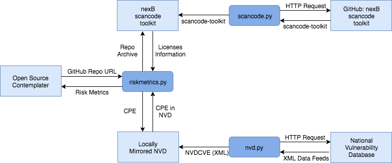

## System Description
RiskMetrics provides risk management metrics for any given github repository. It utilizes nexB's [scancode-toolkit](https://github.com/nexB/scancode-toolkit) to scan a repository's files for license information (i.e., how many files are licensed, what types of licenses are used, etc.). RiskMetrics also constructs and checks the repository's software package’s [Common Platform Enumeration (CPE)](https://scap.nist.gov/specifications/cpe/) against the [National Vulnerability Database (NVD)](https://nvd.nist.gov). Presence in this database indicates a documented security vulnerability within the software package.

### Use Case
- _Title:_ Provide Risk Management Metrics on Software Package
- _Primary Actor:_ Open Source Contemplator (someone interested in utilizing OSS)
- _Goal in Context:_ Provide metrics for determination of risk in any given software package
- _Stakeholders:_ Open Source Contemplator, Software Package Vendor
- _Preconditions_ Software package is present in system
- _Main Success Scenario:_ Software package is analyzed and results outputted
- _Failed End Conditions:_ Software package fails to be analyzed
- _Trigger:_ Executes ./start.sh and provides software package

## Dependencies
* [Python 2.7.x](https://www.python.org/download/releases/2.7/)
* [virtualenv 15.0.1+](https://virtualenv.pypa.io/en/stable/)
* [scancode-toolkit-1.6.0](https://github.com/nexB/scancode-toolkit) (this will be automatically installed during usage)

## Installation
### Ubuntu 16.04.2+ (with at least 2 GB Ram)
0. [Python 2.7](https://www.python.org/download/releases/2.7/) ships with Ubuntu 16
1. Install [virtualenv 15.0.1+](https://virtualenv.pypa.io/en/stable/)
   * `sudo apt install virtualenv`
2. In a Terminal, set your working directory where you want to install RiskMetrics
3. In that directory, run `git clone https://github.com/hacksmath/RiskMetrics.git`
   * If git is not installed, intall git with `sudo apt install git` or manually download RiskMetrics
4. Change directories to the newly downloaded RiskMetrics
5. Create a virtualenv to install python dependencies with `virtualenv env`
6. Activate the virtualenv with `source env/bin/activate`
7. Install python dependencies with pip `pip install -r requirements.txt`
   * This will install [requests](http://docs.python-requests.org/en/master/) and [pytest](https://docs.pytest.org/en/latest/) in the virtualenv

## Usage
1. In the RiskMetrics directory, run `python riskmetrics/riskmetrics.py <github-repo-url>`
   * ScanCode and the NVD will be automatically downloaded and configured as necessary.
2. The results will be displayed on the Terminal 

## Development Environment
Development is currently being performed on macOS Sierra and Windows 10 using Python 2.7.

Those interested in contributing should contact Micah (mswab@unomaha.edu) or Kiet (khtran@unomaha.edu).

## Test Cases
To execute unit tests, run command `pytest` in the test directory.

### Data Flow Diagram

### Database Schema
This section is intentionally empty as no generated data is currently being cached.

### License & Copyright Declarations

RiskMetrics source code licensed under MIT.

Documents licensed under CC BY-SA 4.0.

All work copyright © Micah Swab, Kiet Tran 2017.
